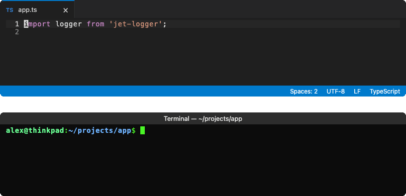

# ✈️🪵 Jet-Logger 

> A super quick, easy to setup TypeScript first logging tool for NodeJS and browsers.

[](https://www.npmjs.com/package/jet-logger)
[](https://www.npmjs.com/package/jet-logger)
[](https://github.com/seanpmaxwell/jet-logger/blob/main/LICENSE)
[](https://www.npmjs.com/package/jet-logger)

<p align="center">· · ·</p>

## 👀 Preview



<p align="center">· · ·</p>

## Features ✨

- Works locally and in browsers
- Zero dependencies, written in TypeScript
- Configure programmatically or through environment variables
- Tiny: **8 kB** packed
- Logs can be sent to the console or a file
- Both plain-text `line` and `json` (JSON Lines) formats supported
- Color-coded `info`, `imp`, `warn`, and `err` levels in terminals

<p align="center">· · ·</p>

## 📦 Installation

```bash
npm install jet-logger
```

> Requires Node.js 20.16+ or 22.3+. Jet-Logger is an ES module; CommonJS projects can `require()` it on Node.js 20.19+ and 22.12+.

<p align="center">· · ·</p>

## ⚡ Quick Start

```ts
import logger from 'jet-logger';

logger.info('Server started on port', 3000);
logger.imp('Connected to the database');
logger.warn('Slow response:', { route: '/users', ms: 1200 });
logger.err('Payment failed:', 'card declined');
```

With the default options, that prints (colors not shown):

```text
[14:03:21.045] INFO: hello jet-logger
[14:03:21.046] IMPORTANT: hello jet-logger
[14:03:21.046] WARNING: hello jet-logger
[14:03:21.046] ERROR: hello jet-logger
```

The default export is a ready-made logger configured from environment variables. To create your own, call `JetLogger()`:

```ts
import { JetLogger } from 'jet-logger';

const fileLogger = JetLogger({
  mode: JetLogger.Modes.FILE,
  filepath: './logs/app.log',
  format: JetLogger.Formats.JSON,
});

fileLogger.info('Written to disk');
```

<p align="center">· · ·</p>

## 📘 Log Methods

| Method          | Description                                                                         |
| --------------- | ----------------------------------------------------------------------------------- |
| `info(...args)` | Log at `INFO` level                                                                 |
| `imp(...args)`  | Log at `IMPORTANT` level                                                            |
| `warn(...args)` | Log at `WARNING` level (stderr in console mode)                                     |
| `err(...args)`  | Log at `ERROR` level (stderr in console mode)                                       |
| `out(...args)`  | Print the arguments as their own line, without a label or timestamp                 |
| `line()`        | Print an empty line                                                                 |
| `catch(fn)`     | Call `fn` and log its error message if it throws or returns a rejected promise      |
| `flush()`       | Returns a promise that resolves once everything logged so far has been written      |
| `close()`       | Flush, then release the log file. Later calls on this logger are ignored            |

Arguments are joined with a space. Objects are printed in full (`util.inspect` in Node, JSON in the browser).

<p align="center">· · ·</p>

## ⚙️ Configuration

Every option can be passed to `JetLogger()` or set with an environment variable. Options passed in code take priority over environment variables, which take priority over the defaults.

| Option                  | Environment variable                  | Values                                         | Default          |
| ----------------------- | ------------------------------------- | ---------------------------------------------- | ---------------- |
| `mode`                  | `JET_LOGGER_MODE`                     | `console`, `file`, `browser`, `custom`, `off`  | `console`        |
| `format`                | `JET_LOGGER_FORMAT`                   | `line`, `json`                                 | `line`           |
| `filepath`              | `JET_LOGGER_FILEPATH`                 | Path of the log file (file mode)               | `jet-logger.log` |
| `prependTimeToFilename` | `JET_LOGGER_PREPEND_TIME_TO_FILENAME` | `true`, `false`                                | `false`          |
| `showTime`              | `JET_LOGGER_SHOW_TIME`                | `true`, `false`                                | `true`           |
| `customTransport`       | —                                     | Your function (required when mode is `custom`) | —                |

- `JetLogger.Modes` and `JetLogger.Formats` hold the mode and format values.
- Environment variables are read when a logger is created. The default logger is created the first time you use it, so variables set after importing (e.g. by a `.env` loader) still apply.
- Environment values are case-insensitive (except `JET_LOGGER_FILEPATH`); unrecognized values are ignored.
- Options set to `undefined` use the default. Invalid or unknown options throw an `InvalidOptionError`, which is exported.

---

### Output formats

`line` uses local time. The console shows just the time of day; files also include the date:

```text
[14:03:21.045] WARNING: something happened               <- console
[2026-09-24 14:03:21.045] WARNING: something happened    <- file
```

Colors are used only when the output is a terminal. Set `NO_COLOR` to turn them off or `FORCE_COLOR` to force them on.

`json` writes one object per line with an ISO timestamp in `time`. Text is joined into `msg`, objects go into `data` (an array if there are several), and the first `Error` adds its message to `msg` and its stack frames to `stack`:

```ts
logger.warn('payment failed:', new Error('card declined'), { orderId: 42 });
```

```json
{"time":"2026-09-25T01:04:01.247Z","level":"WARNING","msg":"payment failed: card declined","data":{"orderId":42},"stack":["at charge (/app/pay.js:10:11)"]}
```

`line` prints messages as-is, so text from users could add fake log lines or terminal escape codes. Use `json` for untrusted input; its values are escaped.

---

### File mode

- Logs are appended to `filepath`. Missing directories are created automatically.
- Loggers writing to the same file share it, so their lines stay in order.
- Lines logged in the same tick are written together in one synchronous write at the end of the tick, or as soon as 64 KB are waiting, so memory use stays small even when logging in bursts.
- Anything not yet written is flushed when the process exits, crashes, or receives `SIGINT` or `SIGTERM`. If your app handles those signals itself, jet-logger flushes and leaves exiting to your handler.
- `await logger.flush()` makes sure everything is on disk; `await logger.close()` also closes the file.
- `prependTimeToFilename` starts a new file each run: `logs/app.log` → `logs/20260925T010401Z_app.log`.
- With the `json` format, the default file name becomes `jet-logger.jsonl`.
- Files are created with your process's default permissions, which usually lets other users read them. Use a stricter `umask` or directory if your logs hold sensitive data.

---

### Browser

In browsers and web workers, `console` and `file` modes switch to `browser` mode automatically, which prints styled logs with `console.info`, `console.warn`, and `console.error`.

<p align="center">· · ·</p>

## 🚚 Custom Transports

Set `mode` to `custom` to send every log to your own function, e.g. to forward it to Datadog, Splunk, or an HTTP collector:

```ts
import { JetLogger, type CustomTransportFn } from 'jet-logger';

const sendToSplunk: CustomTransportFn = async ({ time, level, msg }) => {
  await splunkClient.emit({ time, level, msg });
};

const remoteLogger = JetLogger({
  mode: JetLogger.Modes.CUSTOM,
  customTransport: sendToSplunk,
});

remoteLogger.imp('Sent to Splunk');
await remoteLogger.flush(); // e.g. before exiting: waits for pending sends
```

The function can be async. If it throws or its promise rejects, the error is reported on stderr (`console.error` in browsers) instead of crashing your app.

It receives a `CustomTransportContext`:

```ts
interface CustomTransportContext {
  time: string; // ISO 8601
  level: 'INFO' | 'IMPORTANT' | 'WARNING' | 'ERROR' | null; // null for out() and line()
  msg: string; // all arguments joined into one string
}
```

<p align="center">· · ·</p>

## License

[MIT](./LICENSE) © seanpmaxwell
